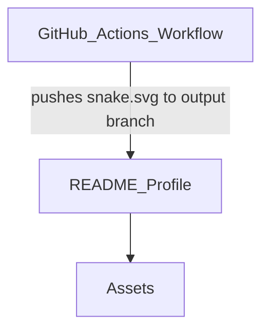

## Stack

Not a code project — this is a GitHub profile README repo (renders on github.com/ALPHAMAN-0). No language/framework/build tooling observed. Content is Markdown + an SVG asset + a GitHub Actions workflow.

## Directory map

| path | what lives there |
|---|---|
| README.md | Profile README rendered on GitHub profile page |
| assets/ | Static assets |
| assets/ascii-portrait.svg | ASCII-art portrait image embedded in README.md |
| .github/workflows/ | CI workflow definitions |
| .github/workflows/snake.yml | Generates contribution "snake" animation SVG on schedule/push |

## Diagram

## Component index

- [[README_Profile]]
- [[Assets]]
- [[GitHub_Actions_Workflow]]

## Entry points

- Dev: none (static Markdown repo, no build step observed)
- Prod: README.md (rendered directly by GitHub as the profile page)

## Conventions

- README.md uses inline HTML (`<table>`, `<h2><code>...</code></h2>`) mixed with Markdown, terminal-prompt style headers (observed in README.md).
- Workflow file targets a separate `output` branch for generated content (`.github/workflows/snake.yml` line 34: `target_branch: output`).

## Where things go

- To edit profile content/links: edit README.md
- To change the portrait image: replace assets/ascii-portrait.svg and its reference in README.md
- To change the snake animation schedule or styling: edit .github/workflows/snake.yml
