<div align="center">

<!-- HEADER BANNER -->


<!-- TYPING SVG -->
<a href="https://git.io/typing-svg">
  
</a>

<!-- SOCIAL BADGES -->
<br/>

[](https://www.linkedin.com/in/siamhossain4/) [](https://siamhossain.vercel.app/) [](https://x.com/SIAM_HOSSAIN47) [](mailto:siam.cse.aiub@gmail.com) [](https://wa.me/8801766479295) [](https://codolio.com/profile/babaYagaa)

<br/>

<a href="https://siamhossain.vercel.app/about.html" target="_blank">
  
</a>

</div>

<br/>

<!-- BOOT SEQUENCE -->

```console
[  OK  ] Mounting /dev/brain
[  OK  ] Loading kernel modules: mern.ko  mean.ko  transformers.ko  tcpip.ko
[  OK  ] Starting daemon: curiosity.service
[ FAIL ] Starting daemon: sleep.service — blocked by side_projects
[  OK  ] Reached target: Full-Stack x AI Engineer (in training)

siam@dhaka:~$ _
```


<!-- ABOUT ME -->

## <code>$ whoami</code>



<samp>siam@dhaka:~$ cat ~/profile.yaml</samp>

```yaml
name: Siam Hossain
location: Dhaka, Bangladesh 🇧🇩
role: Student & Aspiring Full-Stack + ML Engineer
portfolio: https://siamhossain.vercel.app

currently:
  learning:
    - MERN Stack (MongoDB, Express, React, Node.js)
    - MEAN Stack (MongoDB, Express, Angular, Node.js)
    - Machine Learning & LLM Internals
    - Prompt Engineering & AI Agents
    - Computer Network Engineering
  exploring: [ How LLMs work under the hood, RAG, Fine-tuning ]
  building: [ Full-stack apps & AI-powered projects ]

interests:
  - Full-Stack Web Development (MERN / MEAN)
  - Machine Learning & Large Language Models
  - AI Agents & Prompt Engineering
  - Computer Networking & Cloud Infrastructure
```

<details><summary><code>$ gpg --decrypt fun_fact.gpg</code></summary>
<br/>

`"I debug with console.log and I'm not ashamed."`

</details>

<br clear="both"/>


<!-- TECH STACK -->

<h2 align="center"><code>$ ./skills.sh --list</code></h2>

<div align="center">

<table>
<tr>
<td align="center" width="25%">


<br/><br/>


</td>
<td align="center" width="25%">


<br/><br/>


</td>
<td align="center" width="25%">


<br/><br/>


</td>
<td align="center" width="25%">


<br/><br/>


</td>
</tr>
</table>

</div>


<!-- CURRENTLY LEARNING -->

<h2 align="center"><code>$ nmap -sV --script=curiosity siam.dev</code></h2>

```console
Starting Nmap 7.95 ( https://nmap.org )

PORT      STATE     SERVICE          VERSION
3000/tcp  open      mern-stack       React + Node + Express + MongoDB
4200/tcp  open      mean-stack       Angular front, same battle-tested backend
8080/tcp  open      llm-internals    attention, tokenizers, KV-cache, inference
6333/tcp  open      rag-pipeline     embeddings, vector search, retrieval
5000/tcp  open      fine-tuning      LoRA / PEFT / prompt engineering
22/tcp    open      networking       TCP/IP, OSI, routing, wireshark captures

Service detection performed. 6/6 services flagged: STATUS=LEARNING
Nmap done: 1 host up — patching skills daily
```


<!-- GITHUB ANALYTICS -->

<h2 align="center"><code>$ git log --author="ALPHAMAN-0" --stat</code></h2>

<div align="center">
  
  
</div>

<br/>

<div align="center">
  
</div>

<br/>

<div align="center">
  
</div>

<br/>

<div align="center">
  
</div>


<!-- SNAKE -->

<h2 align="center"><code>$ python3 snake.py --feed=contributions</code></h2>

<div align="center">
  
</div>


<!-- FOOTER -->

<div align="center">

 

<br/>

<samp>Connection to siam@dhaka closed. &nbsp;•&nbsp; exit code 0 &nbsp;•&nbsp; see you in the grid.</samp>


</div>
