<!-- HERO -->

<table>
<tr>
<td width="58%" valign="middle">

# Siam Hossain

<samp>siam@dhaka ❯ full-stack + ML/AI engineer in training · Dhaka, Bangladesh 🇧🇩</samp>

<picture>
  <source media="(prefers-color-scheme: dark)" srcset="assets/hero.svg">
  
</picture>

</td>
<td width="42%" align="center">

<picture>
  <source media="(prefers-color-scheme: dark)" srcset="assets/ascii-portrait.svg">
  
</picture>

</td>
</tr>
</table>

<p>
<a href="https://www.linkedin.com/in/siamhossain4/"><picture><source media="(prefers-color-scheme: dark)" srcset="assets/chip-linkedin.svg"></picture></a>
<a href="https://siamhossain.vercel.app/"><picture><source media="(prefers-color-scheme: dark)" srcset="assets/chip-portfolio.svg"></picture></a>
<a href="https://x.com/SIAM_HOSSAIN47"><picture><source media="(prefers-color-scheme: dark)" srcset="assets/chip-x.svg"></picture></a>
<a href="mailto:siam.cse.aiub@gmail.com"><picture><source media="(prefers-color-scheme: dark)" srcset="assets/chip-gmail.svg"></picture></a>
<a href="https://wa.me/8801766479295"><picture><source media="(prefers-color-scheme: dark)" srcset="assets/chip-whatsapp.svg"></picture></a>
<a href="https://codolio.com/profile/babaYagaa"><picture><source media="(prefers-color-scheme: dark)" srcset="assets/chip-resume.svg"></picture></a>
</p>

<picture><source media="(prefers-color-scheme: dark)" srcset="assets/rule.svg"></picture>

<!-- ABOUT -->

<h2><code>siam@dhaka ❯ cat ~/currently.yaml</code></h2>

```yaml
currently:
  learning:
    - MERN Stack (MongoDB, Express, React, Node.js)
    - MEAN Stack (MongoDB, Express, Angular, Node.js)
    - Machine Learning & LLM Internals
    - Prompt Engineering & AI Agents
    - Computer Network Engineering
  exploring: [ How LLMs work under the hood, RAG, Fine-tuning ]
  building: [ Full-stack apps & AI-powered projects ]

interests:
  - Full-Stack Web Development (MERN / MEAN)
  - Machine Learning & Large Language Models
  - AI Agents & Prompt Engineering
  - Computer Networking & Cloud Infrastructure
```

<picture><source media="(prefers-color-scheme: dark)" srcset="assets/rule.svg"></picture>

<!-- SKILLS -->

<h2><code>siam@dhaka ❯ tree ./stack</code></h2>

<picture>
  <source media="(prefers-color-scheme: dark)" srcset="assets/stack.svg">
  
</picture>

<picture><source media="(prefers-color-scheme: dark)" srcset="assets/rule.svg"></picture>

<!-- FEATURED PROJECTS -->

<h2><code>siam@dhaka ❯ ls ./projects</code></h2>

<table>
<tr>
<td width="50%">
<a href="https://github.com/ALPHAMAN-0/Sales_Inventory_CRM"><picture><source media="(prefers-color-scheme: dark)" srcset="assets/card-sales-inventory-crm.svg"></picture></a>
</td>
<td width="50%">
<a href="https://github.com/ALPHAMAN-0/Sleep_Loop"><picture><source media="(prefers-color-scheme: dark)" srcset="assets/card-sleep-loop.svg"></picture></a>
</td>
</tr>
<tr>
<td width="50%">
<a href="https://github.com/ALPHAMAN-0/AIUB_NOTICE_BOARD"><picture><source media="(prefers-color-scheme: dark)" srcset="assets/card-aiub-notice-board.svg"></picture></a>
</td>
<td width="50%">
<a href="https://github.com/ALPHAMAN-0/CodeAlpha_RealTimeCommunicationApp"><picture><source media="(prefers-color-scheme: dark)" srcset="assets/card-realtime-comms.svg"></picture></a>
</td>
</tr>
</table>

<picture><source media="(prefers-color-scheme: dark)" srcset="assets/rule.svg"></picture>

<!-- GITHUB STATS -->
<!-- Both images below are built every 12h by .github/workflows/profile-assets.yml
     and published to the `output` branch, so they are served from GitHub's own
     CDN rather than a third-party card service. -->

<h2><code>siam@dhaka ❯ git log --stat</code></h2>

<picture>
  <source media="(prefers-color-scheme: dark)" srcset="https://raw.githubusercontent.com/ALPHAMAN-0/ALPHAMAN-0/output/stats.svg">
  
</picture>

<picture>
  <source media="(prefers-color-scheme: dark)" srcset="https://raw.githubusercontent.com/ALPHAMAN-0/ALPHAMAN-0/output/snake.svg">
  
</picture>

<picture><source media="(prefers-color-scheme: dark)" srcset="assets/rule.svg"></picture>

<!-- FOOTER -->

<samp>siam@dhaka ❯ exit — session logged, see you in the grid.</samp>
